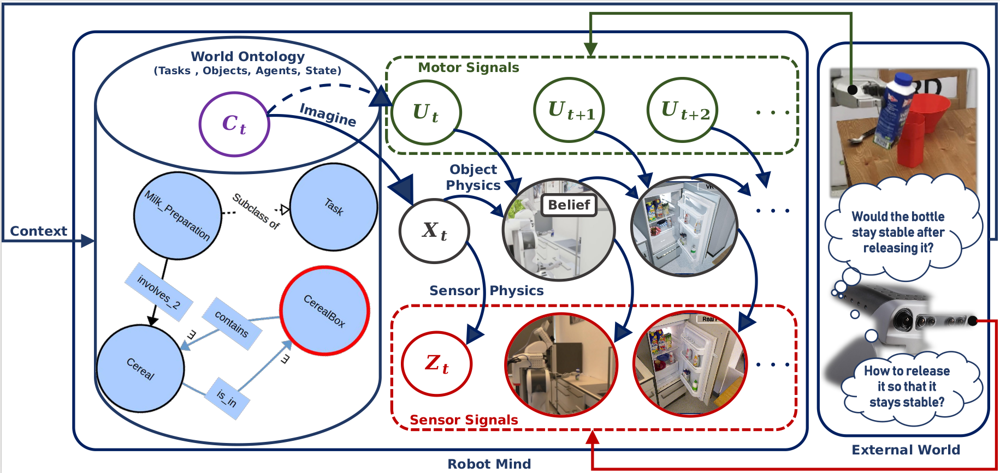
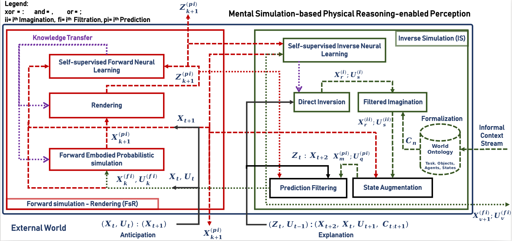

# naivphys4rp
Perception as [inner realistic world construction](https://github.com/NaivPhys4RP/belief_state/) that [anticipates](https://github.com/NaivPhys4RP/forward_simulation_rendering/) and [explains](https://github.com/NaivPhys4RP/inverse_simulation/) the world state as well as observations in an explainable manner, with reasonable computational resources. NaivPhys4RP is a white-box and causal generative model of perception [(See paper)](literature/AcceptedHumanoids2022.pdf).

The principle is illustrated by the figure below:

</img>

NaivPhys4RP is the designed perception system architecture that realizes this principle:

</img>

