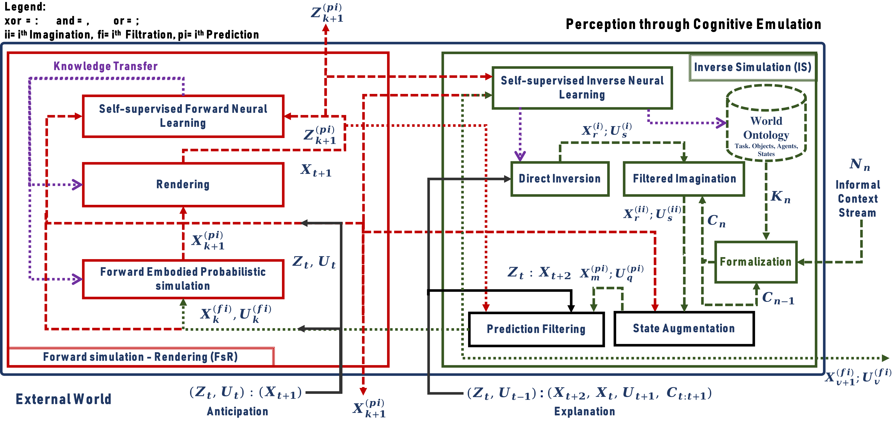

# naivphys4rp
Perception as [inner realistic world construction](https://github.com/NaivPhys4RP/belief_state/) that [anticipates](https://github.com/NaivPhys4RP/forward_simulation_rendering/) and [explains](https://github.com/NaivPhys4RP/inverse_simulation/) the world state as well as observations in an explainable manner, with reasonable computational resources. NaivPhys4RP is a white-box and causal generative model of perception [(See paper)](http://dx.doi.org/10.1109/Humanoids53995.2022.10000153).

The principle is illustrated by the figure below:

</img>

NaivPhys4RP is the designed perception system architecture that realizes this principle:

</img>

For more details on the distribution of packages in this architecture is as follows:

</img>

The scientific publications related to this work are:

1. *IROS October 2020 [Presented - First Author]:*
**[RobotVQA -A Scene-Graph-and Deep-Learning-based Visual Question Answering System for Robot Manipulation](https://ieeexplore.ieee.org/document/9341186)**

2. *ICRA May 2021 [Presented - Third Author]:*
**The Robot Household Marathon Experiment**

3. *IROS October 2021 [Presented - Second Author]:*
**Imagination-enabled Robot Perception**

4. *Humanoids November 2022 [Presented - First Author]:*
**NaivPhys4RP -Towards Human-like Robot Perception: "Physical Reasoning based on Embodied Probabilistic Simulation"**

5. *KR September 2023 [Presented - Second Author]:*
**Knowledge-Driven Robot Program Synthesis from Human VR Demonstrations**

6. *ICRA September 2023 [Submitted - First Author]:* 
**Perception through Cognitive Emulation: “A Second Iteration of NaivPhys4RP for Learningless and Safe Recognition and 6D-Pose Estimation of (Transparent) Objects from Poor Sensor Data”**
