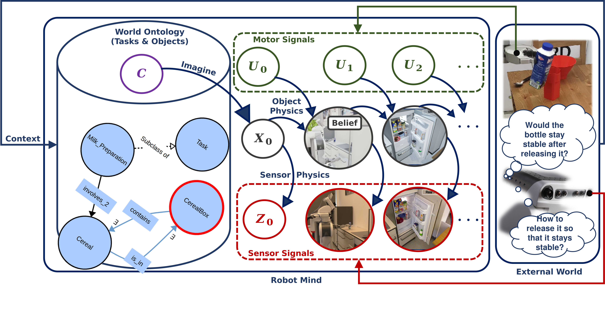
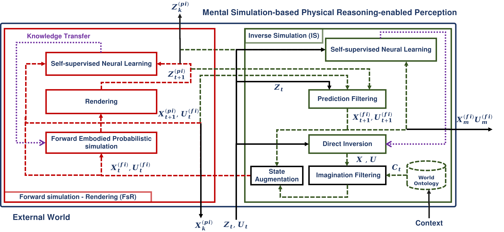

# naivphys4rp
Perception as [inner realistic world construction](../belief_state) that anticipates and explains the world state as well as observations in an explainable manner, with reasonable computational resources.

The principle is illustrated by the figure below:

</img>

NaivPhys4RP is the designed perception system architecture that realizes this principle:

</img>

